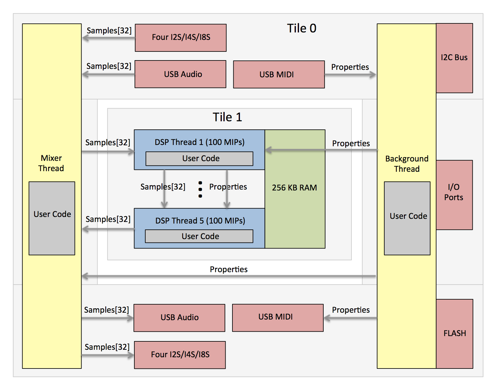

FlexFX&trade; Kit
==================================

FlexFX hardware supports USB Audio and MIDI, 32/64-bit DSP, up to 32 audio channels, 48 to 384 kHz sampling rates, input to output latency of 350 microseconds. Devices can be updated with pre-built effects or custom designed effects at any time using standard USB/MIDI. No apps purchases, download costs, or user accounts are needed to load FlexFX pre-built effects to to develop your own custom applications/effects.

**Customization**  
FlexFX development Kit:  https://github.com/markseel/flexfx_kit  
Compiler and Linker:     xTIMEcomposer (current version for FlexFX is 14.3.3) is available from www.xmos.com  

**Support**  
FlexFX user's forum:     https://flexfx.discussion.community  
XMOS xCORE Forum:        https://www.xcore.com  

Introduction
--------------------------------

The FlexFX&trade; Kit provides a light framework for developing audio processing applications running on FlexFX&trade;
hardware modules and boards.
It  implements USB class 2.0 audio input and output, USB MIDI handling and routing,
up to four I2S/TDM interfaces (for multiple ADCs/DACs/CODECs), and firmware
upgrades allowing custom audio application development to remain focused on custom signal processing and
run-time algorithm control.



* Simple framework for writing custom audio processing applications
* Up to 500 MIPs available for signal processing algorithms (FlexFX module with XUF216)
* 32/64 bit fixed point DSP support, single-cycle instructions
* Up to 32x32 (48 kHz) channels of USB and I2S audio, up to 192 kHz audio sample rate at 8x8
* Single audio cycle DSP processing for all 32 channels (e.g. audio block size = 1)
* System latency (ADC I2S to DSP to DAC I2S) of 16 audio cycles (16/Fs). 
* USB interface for USB audio streaming ad USB MIDI for effects control and firmware updating
* Functions for I2C bus (for peripheral control) and port input/output
* I2S supports up to 8-slot TDM and up to four separate ADCs and four separate DACs

Getting Started
--------------------------------

1) Download and install the free XMOS development tools from www.xmos.com.

2) Obtain the FlexFX™ dev-kit for building your own apps from “https://github.com/markseel/flexfxkit”.    
     Download the ZIP file or use GIT …
```
git clone https://github.com/flexfx/flexfx.github.io.git
```

3) Set environment variables for using XMOS command-line build tools …
```
Windows         c:\Program Files (x86)\XMOS\xTIMEcomposer\Community_14.3.3\SetEnv.bat
OS X or Linux   /Applications/XMOS_xTIMEcomposer_Community_14.3.3/SetEnv.command
```

4) Add your own source code to a new 'C' file (e.g. ‘application.c’).

5) Build the application …
```
xcc -report -O3 -lquadflash xio.xn xio.a flexfx.xc application.c -o appliocation.xe
```

6) Burn the firmware executable directly to FLASH or create a binary image for loading over USB/MIDI using the firwmare upgrade process.  Firmware can be upgraded via via Pyhon and "flexfx.py", via Google Chrome and "flexfx.html", or via a custom application that uses USB/MIDI and FlexFX property data to perform a firmware upgrade.
```
xflash --no-compression --factory-version 14.3 —-upgrade 1 application.xe
 — or —
xflash --no-compression --factory-version 14.3 --upgrade 1 application.xe -o application.bin
python flexfx.py 0 application.bin
```

7) A FlexFX system can be firmware upgraded using USB/MIDI.  But if that fails due to misbehaving custom FLexFX programs or FLASH data corruption you can to revert your system back to its original/factory condition.  After resotring the system to its original/factory condition use steps 4/5/6 for custom FlexFX aoplication develoopment and firmware upgrading.  Use the JTAG device (XMOS XTAG2 or XTAG3) to load the factory FlexFX firmware into the factory and upgrade portions of the FLASH boot partitioin ...
```
xflash --boot-partition-size 1048576 --no-compression --factory xio.xe --upgrade 1 xio.xe
```

You can create custom audio processing effects by downloading the FlexFX&trade; audio processing framework, adding custom audio processing DSP code and property handling code, and then compiling and linking using XMOS tools (xTIMEcomposer, free to download).
The custom firmware can then be burned to FLASH using xTIMEcomposer and the XTAG-2 or XTAG-3 JTAG board ($20 from Digikey), via USB/MIDI (there are special properties defined for firmware upgrading and boot image selection).

FlexFX&trade; implements the USB class 2.0 audio and USB MIDI interfaces, the I2S/CODEC interface, sample data transfer from USB/I2S/DSP threads, property/parameter routing, and firmware upgrading. FlexFX provides functions for peripheral control (GPIO's and I2C), FLASH memory access, fixed point scalar adn vector math, and a wide range of DSP functions.

All one has to do then is add DSP code and any relevant custom property handling code to the five audio processing threads which all run in parallel and implement a 5-stage audio processing pipeline.
Each processing thread is allocated approximately 100 MIPS and executes once per audio cycle.
All threads are executed once per audio cycle and therefore operate on USB and I2S sample data one audio frame at a time.

Programming Interface
-----------------------------------------

The 'xio.h' file defines the application interface for USB/I2S audio and MIDI applications while 'flexfx.h' defines DSP functions and helper functions for creating audio effects applications.

XIO.H

```C
#ifndef INCLUDED_XIO_H
#define INCLUDED_XIO_H

// FQ converts Q28 fixed-point to floating point
// QF converts floating-point to Q28 fixed-point

#define QQ 28
#define FQ(hh) (((hh)<0.0)?((int)((double)(1u<<QQ)*(hh)-0.5)):((int)(((double)(1u<<QQ)-1)*(hh)+0.5)))
#define QF(xx) (((int)(xx)<0)?((double)(int)(xx))/(1u<<QQ):((double)(xx))/((1u<<QQ)-1))

typedef unsigned char byte;
typedef unsigned int  bool;

// Functions and variables to be implemented by the application ...

extern const char* product_name_string;   // Your product name
extern const char* usb_audio_output_name; // Your USB audio output name
extern const char* usb_audio_input_name;  // Your USB audio input name
extern const char* usb_midi_output_name;  // Your USB MIDI output name
extern const char* usb_midi_input_name;   // Your USB MIDI input name

extern const int audio_sample_rate;       // Audio sampling frequency (48K,96K,192K,or 384K)
extern const int usb_output_chan_count;   // 2 USB audio output channels (32 max)
extern const int usb_input_chan_count;    // 2 USB audio input channels (32 max)
extern const int i2s_channel_count;       // 2,4,or8 I2S channels per SDIN/SDOUT wire

extern const int i2s_sync_word[8];        // I2S WCLK words for each slot

extern const char controller_script[];

// The control task is called at a rate of 1000 Hz and should be used to implement audio CODEC
// initialization/control, pot and switch sensing via I2C ADC's, handling of properties from USB
// MIDI, and generation of properties to be consumed by the USB MIDI host and by the DSP threads.
// The incoming USB property 'rcv_prop' is valid if its ID is non-zero and an outgoing USB
// property, as a response to the incoming property, will be sent out if's ID is non-zero. DSP
// propertys can be sent to DSP threads (by setting the DSP property ID to zero) at any time.
// It's OK to use floating point calculations here as this thread is not a real-time audio thread.

extern void app_control( const int rcv_prop[6], int snd_prop[6], int dsp_prop[6] );

// The mixer function is called once per audio sample and is used to route USB, I2S and DSP samples.
// This function should only be used to route samples and for very basic DSP processing - not for
// substantial sample processing since this may starve the I2S audio driver. Do not use floating
// point operations since this is a real-time audio thread - all DSP operations and calculations
// should be performed using fixed-point math.
// NOTE: IIR, FIR, and BiQuad coeff and state data *must* be declared non-static global!

extern void app_mixer( const int usb_output[32], int usb_input[32],
                       const int i2s_output[32], int i2s_input[32],
                       const int dsp_output[32], int dsp_input[32], const int property[6] );

// Audio Processing Threads. These functions run on tile 1 and are called once for each audio sample
// cycle. They cannot share data with the controller task or the mixer functions above that run on
// tile 0. The number of incoming and outgoing samples in the 'samples' array is set by the constant
// 'dsp_chan_count' defined above. Do not use floating point operations since these are real-time
// audio threads - all DSP operations and calculations should be performed using fixed-point math.
// NOTE: IIR, FIR, and BiQuad coeff and state data *must* be declared non-static global!

// Process samples and properties from the app_mixer function. Send results to stage 2.
extern void app_thread1( int samples[32], const int property[6] );
// Process samples and properties from stage 1. Send results to stage 3.
extern void app_thread2( int samples[32], const int property[6] );
// Process samples and properties from stage 2. Send results to stage 4.
extern void app_thread3( int samples[32], const int property[6] );
// Process samples and properties from stage 3. Send results to stage 5.
extern void app_thread4( int samples[32], const int property[6] );
// Process samples and properties from stage 4. Send results to the app_mixer function.
extern void app_thread5( int samples[32], const int property[6] );

// FLASH read write functions.

void flash_read ( int blocknum, byte buffer[4096] );
void flash_write( int blocknum, const byte buffer[4096] );

void timer_delay( int microseconds );

// I2C functions for peripheral control (do not use these in real-time DSP threads).

void i2c_start( int speed );  // Set bit rate, assert an I2C start condition.
byte i2c_write( byte value ); // Write 8-bit data value.
byte i2c_read ( void );       // Read 8-bit data value.
void i2c_ack  ( byte ack );   // Assert the ACK/NACK bit after a read.
void i2c_stop ( void );       // Assert an I2C stop condition.

void port_set( int mask, int value ); // Write 0 or 1 to ports/pins indicated by 'mask'
int  port_get( int mask );            // Read ports indicated by 'mask', set to HiZ state

// Read ADC values via I2C.  This function supports the MAX11600-MAX11605 series of devices.

void adc_read( double values[8] ); // 0.0 <= value[n] < 1.0

void log_chr( char val );
void log_str( const char* val );
void log_bin( const byte* data, int len );
void log_hex( unsigned char val );
void log_hex2( unsigned val );
void log_hex4( unsigned val );
void log_dec( int value, int width, char pad );

#endif
```

FLEXFX.H

```C
#ifndef INCLUDED_FLEXFX_H
#define INCLUDED_FLEXFX_H

#include "xio.h"

void flexfx_control( byte presets[20], bool updated, int dsp_prop[6] );

// FQ converts Q28 fixed-point to floating point
// QF converts floating-point to Q28 fixed-point

#define QQ 28
#define FQ(hh) (((hh)<0.0)?((int)((double)(1u<<QQ)*(hh)-0.5)):((int)(((double)(1u<<QQ)-1)*(hh)+0.5)))
#define QF(xx) (((int)(xx)<0)?((double)(int)(xx))/(1u<<QQ):((double)(xx))/((1u<<QQ)-1))

// MAC performs 32x32 multiply and 64-bit accumulation, SAT saturates a 64-bit result, EXT converts
// a 64-bit result to a 32-bit value (extract 32 from 64), LD2/ST2 loads/stores two 32-values
// from/to 64-bit aligned 32-bit data arrays at address PP. All 32-bit fixed-point values are QQQ
// fixed-point formatted.
//
// AH (high) and AL (low) form the 64-bit signed accumulator
// XX, YY, and AA are 32-bit QQQ fixed point values
// PP is a 64-bit aligned pointer to two 32-bit QQQ values

#define DSP_LD2( pp, xx, yy )     asm volatile("ldd %0,%1,%2[0]":"=r"(xx),"=r"(yy):"r"(pp));
#define DSP_ST2( pp, xx, yy )     asm volatile("std %0,%1,%2[0]"::"r"(xx), "r"(yy),"r"(pp));
#define DSP_MUL( ah, al, xx, yy ) asm volatile("maccs %0,%1,%2,%3":"=r"(ah),"=r"(al):"r"(xx),"r"(yy),"0"(0),"1"(1<<(QQ-1)) );
#define DSP_MAC( ah, al, xx, yy ) asm volatile("maccs %0,%1,%2,%3":"=r"(ah),"=r"(al):"r"(xx),"r"(yy),"0"(ah),"1"(al) );
#define DSP_SAT( ah, al )         asm volatile("lsats %0,%1,%2":"=r"(ah),"=r"(al):"r"(QQ),"0"(ah),"1"(al));
#define DSP_EXT( ah, al, xx )     asm volatile("lextract %0,%1,%2,%3,32":"=r"(xx):"r"(ah),"r"(al),"r"(QQ));
#define DSP_DIV( qq,rr,ah,al,xx ) asm volatile("ldivu %0,%1,%2,%3,%4":"=r"(qq):"r"(rr),"r"(ah),"r"(al),"r"(xx));

inline int dsp_mul( int xx, int yy ) // RR = XX * YY
{
    int ah = 0; unsigned al = 1<<(QQ-1);
    asm("maccs %0,%1,%2,%3":"=r"(ah),"=r"(al):"r"(xx),"r"(yy),"0"(ah),"1"(al) );
    asm("lextract %0,%1,%2,%3,32":"=r"(ah):"r"(ah),"r"(al),"r"(QQ));
    return ah;
}

inline int dsp_mac( int xx, int yy, int zz ) // RR = XX * YY + ZZ
{
    int ah = 0; unsigned al = 0;
    asm("maccs %0,%1,%2,%3":"=r"(ah),"=r"(al):"r"(xx),"r"(yy),"0"(0),"1"(zz) );
    asm("lextract %0,%1,%2,%3,32":"=r"(ah):"r"(ah),"r"(al),"r"(QQ));
    return ah;
}

inline int dsp_ext( int ah, int al ) // RR = AH:AL >> (64-QQ)
{
    asm volatile("lextract %0,%1,%2,%3,32":"=r"(ah):"r"(ah),"r"(al),"r"(QQ));
    return ah;
}

extern int dsp_sine_10[ 1024], dsp_atan_10[ 1024], dsp_tanh_10[ 1024], dsp_nexp_10[ 1024];
extern int dsp_sine_12[ 4096], dsp_atan_12[ 4096], dsp_tanh_12[ 4096], dsp_nexp_12[ 4096];
extern int dsp_sine_14[16384], dsp_atan_14[16384], dsp_tanh_14[16384], dsp_nexp_14[16384];

// Math and filter functions.
//
// XX, CC, SS, Yn, MM, and AA are 32-bit fixed point samples/data in QQQ format
// DD is the distance (0<=DD<1) between the first two points for interpolation
// KK is a time constant, QQQ format
// Yn are the data points to be interpolated
// NN is FIR filter tap-count for 'fir', 'upsample', 'dnsample' and 'convolve' functions
// NN is IIR filter order or or IIR filter count for cascaded IIR's
// NN is number of samples in XX for scalar and vector math functions
// CC is array of 32-bit filter coefficients - length is 'nn' for FIR, nn * 5 for IIR
// SS is array of 32-bit filter state - length is 'nn' for FIR, nn * 4 for IIR, 3 for DCBLOCK
// RR is the up-sampling/interpolation or down-sampling/decimation ratio
// AH (high) and AL (low) form the 64-bit signed accumulator

int  math_random ( int  gg, int seed );              // Random number, gg = previous value
int  math_sqr_x  ( int xx );                         // r = xx^0.5
int  math_min_X  ( const int* xx, int nn );          // r = min(X[0:N-1])
int  math_max_X  ( const int* xx, int nn );          // r = max(X[0:N-1])
int  math_avg_X  ( const int* xx, int nn );          // r = mean(X[0:N-1])
int  math_rms_X  ( const int* xx, int nn );          // r = sum(X[0:N-1]*X[0:N-1]) ^ 0.5
void math_sum_X  ( const int* xx, int nn, int* ah, unsigned* al ); // ah:al = sum(X[0:N-1])
void math_asm_X  ( const int* xx, int nn, int* ah, unsigned* al ); // ah:al = sum(abs(X[0:N-1))
void math_pwr_X  ( const int* xx, int nn, int* ah, unsigned* al ); // ah:al = sum(X[0:N-1]*X[0:N-1])
void math_abs_X  ( int* xx, int nn );                // X[0:N-1] = abs(X[0:N-1])
void math_sqr_X  ( int* xx, int nn );                // X[0:N-1] = X[0:N-1]^0.5
void math_mac_X1z( int* xx, int        zz, int nn ); // X[0:N-1] = X[0:N-1] + zz
void math_mac_X1Z( int* xx, const int* zz, int nn ); // X[0:N-1] = X[0:N-1] + zz[0:N-1]
void math_mac_Xy0( int* xx, int        yy, int nn ); // X[0:N-1] = X[0:N-1] * y
void math_mac_XY0( int* xx, const int* yy, int nn ); // X[0:N-1] = X[0:N-1] * Y[0:N-1]
void math_mac_Xyz( int* xx, int        yy, int zz,        int nn ); // X[] = X[] * y + z
void math_mac_XyZ( int* xx, int        yy, const int* zz, int nn ); // X[] = X[] * y + Z[]
void math_mac_XYz( int* xx, const int* yy, int        zz, int nn ); // X[] = X[] * Y[] + z
void math_mac_XYZ( int* xx, const int* yy, const int* zz, int nn ); // X[] = X[] * Y[] + Z[]

// Math and filter functions.
//
// XX, CC, SS, Yn, MM, and AA are 32-bit fixed point samples/data in QQQ format
// DD is the distance (0<=DD<1) between the first two points for interpolation
// KK is a time constant, QQQ format
// Yn are the data points to be interpolated
// NN is FIR filter tap-count for 'fir', 'upsample', 'dnsample' and 'convolve' functions
// NN is IIR filter order or or IIR filter count for cascaded IIR's
// NN is number of samples in XX for scalar and vector math functions
// CC is array of 32-bit filter coefficients - length is 'nn' for FIR, nn * 5 for IIR
// CU is array of coefficients specifically for FIR upsampling - see 'mix_fir_coeffs'
// SS is array of 32-bit filter state - length is 'nn' for FIR, nn * 4 for IIR
// SS is array of 32-bit filter state - length is 3 for DCBLOCK, 2 for state-variable filter
// CC length is 3/5/7 and SS length is 2/4/6 fir IIR1/IIR2/IIR3 respectively
// RR is the up-sampling/interpolation or down-sampling/decimation ratio
// AH (high) and AL (low) form the 64-bit signed accumulator

int  dsp_blend   ( int dry, int wet, int blend );     // 0 (100% dry) <= MM <= 1 (100% wet)
int  dsp_interp  ( int  dd, int y1, int y2 );         // 1st order (linear) interpolation
int  dsp_lagrange( int  dd, int y1, int y2, int y3 ); // 2nd order (Lagrange) interpolation
void dsp_statevar( int* xx, const int* cc, int* ss ); // x[0]=in,xx[0:2]=lp/bp/hp out, c[0]=Fc,cc[1]=Q
int  dsp_iir1    ( int  xx, const int* cc, int* ss ); // 1st order IIR filter - cc[3]=b0,b1,a1
int  dsp_iir2    ( int  xx, const int* cc, int* ss ); // 2nd order IIR filter - cc[5]=b0,b1,b2,a1,a2
int  dsp_iir3    ( int  xx, const int* cc, int* ss ); // 3rd order IIR filter - cc[7]=b0..b3,a1..a3
int  dsp_biquad  ( int  xx, const int* cc, int* ss, int nn ); // nn Cascaded bi-quad IIR filters
int  dsp_fir     ( int  xx, const int* cc, int* ss, int nn ); // FIR filter of nn taps
void dsp_fir_up  ( int* xx, const int* cU, int* ss, int nn, int rr ); // FIR up-sampling/interpolation
void dsp_fir_dn  ( int* xx, const int* cc, int* ss, int nn, int rr ); // FIR dn-sampling/decimation
void dsp_cic_up  ( int* xx, const int* cc, int* ss, int nn, int rr ); // CIC up-sampling/interpolation
void dsp_cic_dn  ( int* xx, const int* cc, int* ss, int nn, int rr ); // CIC dn-sampling/decimation
int  dsp_convolve( int  xx, const int* cc, int* ss, int* ah, int* al, int nn ); // NN*24 taps

// FIXME: dsp_statevar is not working properly.

void mix_fir_coeffs( int* upsample_cc, int* fir_cc, int nn, int rr );
 
// Filter coefficient calculation functions (do not use these in real-time DSP threads).
//
// CC is an array of floating point filter coefficients
// FF, QQ, GG are the filter frequency, filter Q-factor, and filter gain
// For low/high pass filters set QQ to zero to create a single-pole 6db/octave filter
// GB/GM/GT are bass/mid/treble gains (0.0=min, 1.0=max).
// VB/VM/Vt are bass/mid/treble freq variation from standard (new_freq = standard_freq * variation).

void calc_notch    ( int cc[5], double ff, double qq );
void calc_lowpass  ( int cc[5], double ff, double qq );
void calc_highpass ( int cc[5], double ff, double qq );
void calc_allpass  ( int cc[5], double ff, double qq );
void calc_bandpassQ( int cc[5], double ff, double qq );
void calc_bandpassF( int cc[5], double ff1, double ff2 );
void calc_peaking  ( int cc[5], double ff, double qq, double gg );
void calc_lowshelf ( int cc[5], double ff, double qq, double gg );
void calc_highshelf( int cc[5], double ff, double qq, double gg );
void calc_tonestack( int cc[7], double gb, double gm, double gt, double vb, double vm, double vt );

#endif
```

Minimal Application
-----------------------------------------

The application programmer only needs to add control and audip processing code to create a complete application.  The code below is a complete application.  Just add code to the 'app\_control', 'app\_mixer', and 'app\_thread' functions.

```C
#include "xio.h"

const char* product_name_string   = "Example";           // The product name
const char* usb_audio_output_name = "Example Audio Out"; // USB audio output name
const char* usb_audio_input_name  = "Example Audio In";  // USB audio input name
const char* usb_midi_output_name  = "Example MIDI Out";  // USB MIDI output name
const char* usb_midi_input_name   = "Example MIDI In";   // USB MIDI input name

const int audio_sample_rate     = 192000; // Default sample rate at boot-up
const int dsp_channel_count     = 1;
const int usb_output_chan_count = 2;     // 2 USB audio class 2.0 output channels
const int usb_input_chan_count  = 2;     // 2 USB audio class 2.0 input channels
const int i2s_channel_count     = 2;     // ADC/DAC channels per SDIN/SDOUT wire (2,4,or 8)
const int output_drive_type     = 0;     // 0 for instrument level, 1 for line level.

const int i2s_sync_word[8] = { 0xFFFFFFFF,0x00000000,0,0,0,0,0,0 }; // I2S WCLK values per slot

void app_control( const int rcv_prop[6], int usb_prop[6], int dsp_prop[6] )
{
}

void app_mixer( const int usb_output[32], int usb_input[32],
                const int i2s_output[32], int i2s_input[32],
                const int dsp_output[32], int dsp_input[32], const int property[6] )
{
}

void app_initialize( void ) {}

void app_thread1( int samples[32], const int property[6] ) {}
void app_thread2( int samples[32], const int property[6] ) {}
void app_thread3( int samples[32], const int property[6] ) {}
void app_thread4( int samples[32], const int property[6] ) {}
void app_thread5( int samples[32], const int property[6] ) {}
```

FlexFX Properties
----------------------------------

FlexFX applications can be controlled using FlexFX property exchanges over USB MIDI.
A property is composed of a 16-bit IDC and five 32-bit data words.
The 16-bit property ID must have a non-zero 16-bit value.

An example property is shown below:

```
Property ID = 0x1234
Param 1     = 0x11223344
Param 2     = 0x55667788
Param 3     = 0x99aabbcc
Param 4     = 0x01234567
Param 5     = 0x89abcdef
```

FlexFX properties are transfered via over USB/MIDI using MIDI SYSEX messages.
The FlexFX framework handles parsing and rendering of MIDI SYSEX encapulated FlexFX data therefore the user
application need not deal with MIDi SYSEX - the audio firmware only sees 16-bit ID and five 32-word property values.

For detailed information regarding the encapsulation of FlexFX properties within MIDI SYSEX see the 'flexfx.py' script
that's used to send/receive properties to FlexFX applications via USB.

FlexFX supports the predefined properties with the 16-bit ID being non-zero and less than 0x8000.
User defined properties should therefore use 16-bit ID's greater than or equal to 0x8000.
The predefied properties (0x1000 <= ID <= 0x1FFF) are all handled automatically by the FlexFX framework whereas
properties 0x2pxx and properties 0x8000 to 0xFFFF are forwarded to the application control task ('app_control').

```
ID        DIRECTION        DESCRIPTION
1xxx      Bidirectional    FlexFX default/built-in properties
1000      Bidirectional    Identify the device, return ID (3DEGFLEX) and version numbers
1001      Bidirectional    Begin firmware upgrade, echoed back to host
1002      Bidirectional    Next 32 bytes of firmware image data, echoed
1003      Host to Device   End firmware upgrade and reset (no USB property echo!)
101t      Bidirectional    Return tile T's DSP processing loads (1 <= t <= 3);

2xxx      Bidirectional    FlexFX/C99 pedal hardware support properties
2000      Bidirectional    Read the current volume,tone,preset,bypass settings
2001      Bidirectional    Write the current volume,tone,preset,bypass settings
2002      Bidirectional    Nofitication of changed volume,tone,preset,bypass settings

3xxx      Bidirectional    FlexFX/C99 HTML-configured effects applications properties
30n0      Bidirectional    Read name of bulk data for preset P (P=0 for active config ...)
30n1      Bidirectional    Write name of bulk data and begin data upload for preset P
30n2      Bidirectional    Next 32 bytes of bulk data for preset (1 <= P <= 9 ...)
30n3      Bidirectional    End bulk data upload for preset P (1 <= P <= 9 ...)
31nn      Bidirectional    Read effect title (N=0) or label for parameter N (1 <= N <= 16)
32p0      Bidirectional    Read preset values for preset P (1 <= P <= 9)
32p1      Bidirectional    Write preset values for preset P (1 <= P <= 9)
32p2      Bidirectional    Notification of changed preset settings update for preset P

4xxx      Undefined        User/application defined
5xxx      Undefined        User/application defined
6xxx      Undefined        User/application defined
7xxx      Undefined        User/application defined
8xxx      Undefined        User/application defined
9xxx      Undefined        User/application defined
Axxx      Undefined        User/application defined
Bxxx      Undefined        User/application defined
Cxxx      Undefined        User/application defined
Dxxx      Undefined        User/application defined
Exxx      Undefined        User/application defined
Fxxx      Undefined        User/application defined
```

#### FlexFX ID = 0x1000: Identify; return ID (3DEGFLEX) and versions

```
USB host ---- [ 0x1000,    0,    0,    0,       0, 0 ] ---> Device
USB host <--- [ 0x1000, 3DEG, FLEX, serial_num, 0, 0 ] ---- Device
```
The USB host can use this property to solicit information about that attached device and determine whether or not it is a FlexFX device.  The device will return the flexfx signature words, its serial number, and will echo property words #4 and #5.  Currently the HTML interfrace ('flexfx.html') uses words #4 and #5 to echo back unique ID's used to bind HTML web application instances to a particular USB-attached FlexFX device.

#### FlexFX ID = 0x1100: Return volume,tone,preset,bypass settings

```
USB host ---- [ 0x1100,      0,    0,      0,      0, 0 ] ---> Device
USB host <--- [ 0x1100, volume, tone, preset, bypass, 0 ] ---- Device
```
Returns the current volume, tone, and preset potentiometer positions as well as the effect bypass switch state.
The potentiometer position values are formatted as Q31 fixed point and range from 0.0 (rotated fully counter clockwise) to 0.999... (roated fully clockwise).  The bypass switch state is an integer 0 for bypassed (effect not active) or and integer 1 (effect active).

#### FlexFX ID = 0x120t: Return tile T's DSP processing loads

```
USB host ---- [ 0x120t,     0,     0,     0,     0,     0 ] ---> Device  (t = 0)
USB host <--- [ 0x1200, load1, load2, load3, load4, load5 ] ---- Device
```
Returns the current processing load for each of the five DSP threads.  Values returned are the number of clock ticks (100ns per tick) elapsed per single DSP thread execution pass.  Note that one execution pass occurs for each audio sample.  Therefore if the sampling frequency is 48 kHz then the maximum number of clock ticks allowable, to prevent audio sample underflow, would be 2083 ticks (100000000/48000).

#### FlexFX ID = 0x13nn: Read line NN (20 bytes) of GUI interface text

```
USB host ---- [ 0x13nn,     0,     0,     0,     0,     0 ] ---> Device
USB host <--- [ 0x13nn, text1, text2, text3, text4, text5 ] ---- Device
```
Returns the HTML GUI interface text for the attached device/effect where NN is the text line number (each line contains 20 bytes of text).  Each 32-bit property word (text1 ... text5) contain four 8-bit ASCII characters.  The host must read each line starting with NN=0 and continue reading until a NULL character is found in one of the five property words indicating the end of the complete text.

#### FlexFX ID = 0x1401: Begin firmware upgrade

```
USB host ---- [ 0x1401, 0, 0, 0, 0, 0 ] ---> Device
USB host <--- [ 0x1401, 0, 0, 0, 0, 0 ] ---- Device
```
Open the FLASH device and erase it to begin the firmware upgrade process.

#### FlexFX ID = 0x1402: Continue firmware upgrade

```
USB host ---- [ 0x1402, data1, data2, data3, data4, data5 ] ---> Device
USB host <--- [ 0x1402, data1, data2, data3, data4, data5 ] ---- Device
```
Write the next 40 bytes of firmware data to FLASH.

#### FlexFX ID = 0x1403: End firmware upgrade

```
USB host ---- [ 0x1403, 0, 0, 0, 0, 0 ] ---> Device
USB host <--- [ 0x1403, 0, 0, 0, 0, 0 ] ---- Device
```
Close thge FLASH device and reboot to end the firmware upgrade process.

#### FlexFX ID = 0x1501
#### FlexFX ID = 0x1502
#### FlexFX ID = 0x1503
#### FlexFX ID = 0x1601
#### FlexFX ID = 0x1602
#### FlexFX ID = 0x1603
#### FlexFX ID = 0x1701
#### FlexFX ID = 0x1702
#### FlexFX ID = 0x1703
#### FlexFX ID = 0x1704

#### FlexFX ID = 0x2xxx

Programming Tools
-------------------------------------

The Python script 'flexfx.py' implements various host functions for testing FlexFX firmware via USB.

#### Usage #1

Display attached USB MIDI devices.  The FlexFX DSP board enumerates as device #0 in this example.
```
bash$ python flexfx.py
MIDI Output Devices: 0='FlexFX'
MIDI Input Devices:  0='FlexFX'
```

#### Usage #2

Indefinitely display properties being sent from the DSP board, enumerated as USB MIDI device #0, to the USB host (CRTL-C to terminate).  The first six columns are the 32-bit property ID and five property values printed in hex/ASCII.  The last five columns are the same five property values converted from Q28 fixed-point to floating point.  These rows are printed at a very high rate - as fast as Python can obtain the USB data over MIDI and print to the console. 
```
bash$ python flexfx.py 0
11111111  0478ee7b 08f1dcf7 0478ee7b 00dcd765 fd3f6eac  +0.27952 +0.55905 +0.27952 +0.05392 -0.17201
11111111  0472eb5b 08e5d6b6 0472eb5b 00f5625e fd3ef034  +0.27806 +0.55611 +0.27806 +0.05991 -0.17213
11111111  0472eb5b 08e5d6b6 0472eb5b 00f5625e fd3ef034  +0.27806 +0.55611 +0.27806 +0.05991 -0.17213
11111111  0478ee7b 08f1dcf7 0478ee7b 00dcd765 fd3f6eac  +0.27952 +0.55905 +0.27952 +0.05392 -0.17201
...
```
This video shows the 'flexfx.py' script receiving properties from the DSP board and printing them to the console.
For this example FlexFX firmware is capturing four potentiometer values, packaging them up into a property,
and sending the property to the USB host (see code below).
One of the pots is being turned back and fourth resulting in changes to the corresponding property value.
https://raw.githubusercontent.com/markseel/flexfx_kit/master/flexfx.py.usage2.mp4
```
static void adc_read( double values[4] )
{
    byte ii, hi, lo, value;
    i2c_start( 100000 ); // Set bit clock to 400 kHz and assert start condition.
    i2c_write( 0x52+1 ); // Select I2C peripheral for Read.
    for( ii = 0; ii < 4; ++ii ) {
        hi = i2c_read(); i2c_ack(0); // Read low byte, assert ACK.
        lo = i2c_read(); i2c_ack(ii==3); // Read high byte, assert ACK (NACK on last read).
        value = (hi<<4) + (lo>>4); // Select correct value and store ADC sample.
        values[hi>>4] = ((double)value)/256.0; // Convert from byte to double (0<=val<1.0).
    }
    i2c_stop();
}
void control( int rcv_prop[6], int usb_prop[6], int dsp_prop[6] )
{
    // If outgoing USB or DSP properties are still use then come back later ...
    if( usb_prop[0] != 0 || usb_prop[0] != 0 ) return;
    // Read the potentiometers -- convert the values from float to Q28 using the FQ macro.
    double values[4]; adc_read( values );
    // Create property with three Q28 pot values to send to USB host
    usb_prop[0] = 0x01010000; dsp_prop[4] = dsp_prop[5] = 0;
    usb_prop[1] = FQ(values[0]); usb_prop[2] = FQ(values[1]); usb_prop[3] = FQ(values[2]);
}
```

#### Usage #3

Burn a custom firmware application to the DSP board's FLASH memory (board is enumerated as MIDI device #0).  This takes about 10 seconds.
```
bash$ python flexfx.py 0 app_cabsim.bin
.....................................................................................Done.
```

#### Usage #4

Load impulse response data, stored in a WAV file, to the cabinet simulator example running on the DSP board that is enumerated as MIDI device #0.  This takes less than one second.
```
bash$ python flexfx.py 0 your_IR_file.wav
Done.
```

Design Tools
--------------------------------

There are four Python scripts to aid with algorithm and filter design.  The FIR and IIR design scripts require that the Python packeges 'scipy' and 'matplotlib' are installed.

#### FIR Filter Design Script

```
bash-3.2$ python util_fir.py
Usage: python util_fir <pass_freq> <stop_freq> <ripple> <attenuation>
       <pass_freq> is the passband frequency relative to Fs (0 <= freq < 0.5)
       <stop_freq> is the stopband frequency relative to Fs (0 <= freq < 0.5)
       <ripple> is the maximum passband ripple
       <attenuation> is the stopband attenuation
```

'util_fir.py' is used to generate filter coefficients and to plot the filter response.  These coefficients can be used directly in your custom application 'C' file since the FQ macro converts floating point to Q28 fixed point format required by FlexFX DSP functions.  For this example the filter passband frequency is 0.2 (e.g. 9.6kHz @ 48 kHz Fs), a stopband frequency of 0.3 (e.g. 14.4 kHz @ 48 kHz Fs), a maximum passband ripple of 1.0 dB, and a stopband attenuation of -60 dB.  This script will display the magnitude response and the impulse response, and then print out the 38 filter coefficients for the resulting 38-tap FIR filter.

```
bash-3.2$ python util_fir.py 0.2 0.3 1.0 -60       
int coeffs[38] = 
{	
    FQ(-0.000248008),FQ(+0.000533374),FQ(+0.000955507),FQ(-0.001549687),FQ(-0.002356083),
    FQ(+0.003420655),FQ(+0.004796811),FQ(-0.006548327),FQ(-0.008754448),FQ(+0.011518777),
    FQ(+0.014985062),FQ(-0.019366261),FQ(-0.025001053),FQ(+0.032472519),FQ(+0.042885423),
    FQ(-0.058618855),FQ(-0.085884667),FQ(+0.147517761),FQ(+0.449241500),FQ(+0.449241500),
    FQ(+0.147517761),FQ(-0.085884667),FQ(-0.058618855),FQ(+0.042885423),FQ(+0.032472519),
    FQ(-0.025001053),FQ(-0.019366261),FQ(+0.014985062),FQ(+0.011518777),FQ(-0.008754448),
    FQ(-0.006548327),FQ(+0.004796811),FQ(+0.003420655),FQ(-0.002356083),FQ(-0.001549687),
    FQ(+0.000955507),FQ(+0.000533374),FQ(-0.000248008)
};
```


#### IIR Filter Design Script

```
bash$ python util_iir.py
Usage: python design.py <type> <freq> <Q> <gain>
       <type> filter type (notch, lowpass, highpass, allpass, bandpass, peaking, highshelf, or lowshelf
       <freq> is cutoff frequency relative to Fs (0 <= freq < 0.5)
       <Q> is the filter Q-factor
       <gain> is the filter positive or negative gain in dB
```

'util_iir.py' is used to generate biquad IIR filter coefficients (B0, B1, B2, A1, and A2) and to plot the filter response.  These coefficients can be used directly in your custom application 'C' file since the FQ macro converts floating point to Q28 fixed point format required by FlexFX DSP functions.  For this example a bandpass filter and a peaking filter were designed.  This script will display the magnitude and phase responses and then print out the 38 filter coefficients for the resulting 38-tap FIR filter.

```
bash$ python util_iir.py bandpass 0.25 0.707 12.0
int coeffs[5] = {FQ(+0.399564099),FQ(+0.000000000),FQ(-0.399564099),FQ(-0.000000000),FQ(+0.598256395)};

bash-3.2$ python util_iir.py peaking 0.2 2.5 12.0       
int coeffs[5] = {FQ(+1.259455676),FQ(-0.564243794),FQ(+0.566475599),FQ(-0.564243794),FQ(+0.825931275)};
```


#### WAVE File Parsing Script

'util_wave.py' is used to parse one or more WAVE files and print the WAVE file sample values to the console in floating point format.

```
bash$ python util_wave.py ir1.wav ir2.wav
-0.00028253 +0.00012267 
+0.00050592 -0.00001955 
+0.00374091 +0.00060725 
+0.01383054 +0.00131202 
+0.03626263 +0.00480974 
+0.08285010 +0.01186383 
+0.16732728 +0.03065085 
+0.30201840 +0.08263147 
+0.47006404 +0.20321691 
+0.64849544 +0.41884899 
+0.81581724 +0.72721589 
+0.94237792 +0.97999990 
+0.92178667 +0.96471488 
+0.72284126 +0.66369593 
+0.34437060 +0.25017858 
-0.06371593 -0.16284466 
-0.39860737 -0.51766562 
...
```

#### Data Plotting Script

```
bash$ python util_plot.py
Usage: python plot.py <datafile> time
       python plot.py <datafile> time [beg end]
       python plot.py <datafile> freq lin
       python plot.py <datafile> freq log
Where: <datafile> Contains one sample value per line.  Each sample is an
                  ASCII/HEX value (e.g. FFFF0001) representing a fixed-
                  point sample value.
       time       Indicates that a time-domain plot should be shown
       freq       Indicates that a frequency-domain plot should be shown
       [beg end]  Optional; specifies the first and last sample in order to
                  create a sub-set of data to be plotted
Examle: Create time-domain plot data in 'out.txt' showing samples 100
        through 300 ... bash$ python plot.py out.txt 100 300
Examle: Create frequency-domain plot data in 'out.txt' showing the Y-axis
        with a logarithmic scale ... bash$ python plot.py out.txt freq log
```

The 'util_plot.py' script graphs data contained in a data file which can contan an arbitrary number of data columns of floating point values.  The data can be plotted in the time domain or in the frequency domain.  In this example two cabinet simulation data files are plotted to show their frequency domain impulse responses (i.e the cabinet frequency responses).

```
bash$ python util_wave.py ir1.wav ir2.wav > output.txt
bash$ python util_plot.py output.txt freq log
bash$ python util_plot.py output.txt time 0 150
```


Prebuilt Effects
----------------------------------

The FlexFX kit contains some highly optimized effects. These effects are in source and binary (\*.bin) form and can be used for free on FlexFX boards.  All effects support full control over each effect via FlexFX properties sent and received over USB/MIDI.

The effects also support the HTML5 interface for controlling the device (firmware upgrading, uploading IR data, etc) since the web interfaces uses FlexFX properties and USB/MIDI for control. The HTML5 application called 'flexfx.html' does this automatically and will displayt this device's GUI interface if the device is pluged into the host computer via a USB cable. Google Chrome must be used.

