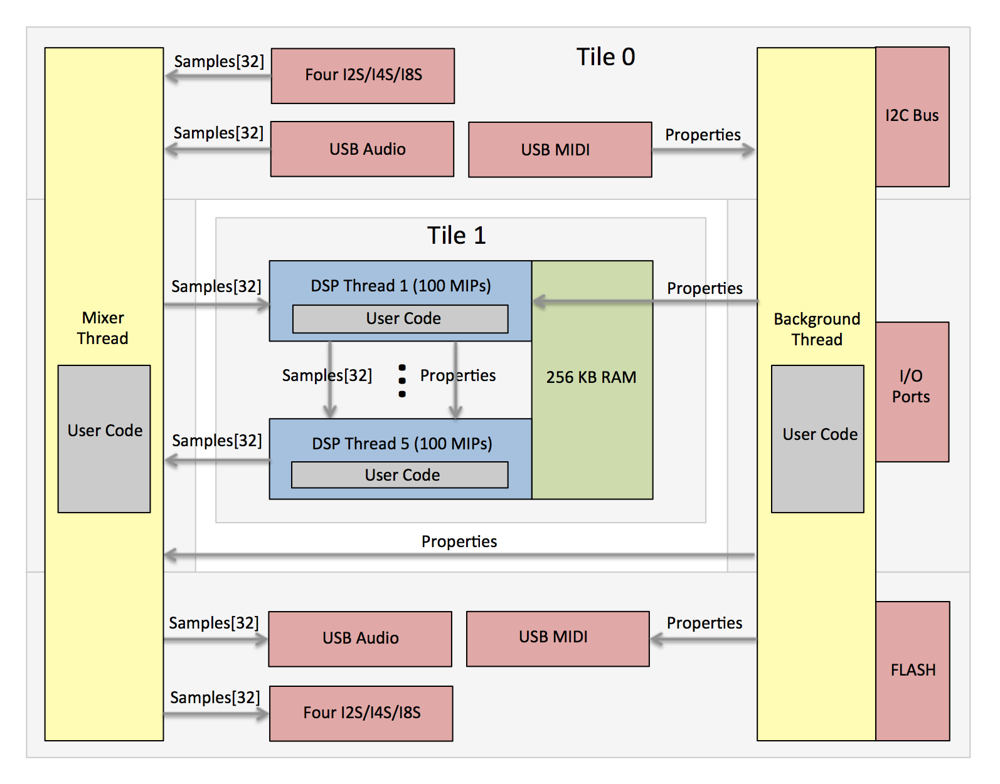

FlexFX&trade; Kit - Introduction
--------------------------------

The FlexFX&trade; Kit provides a light framework for developing audio processing applications running on FlexFX&trade;
hardware modules and boards.
It  implements USB class 2.0 audio input and output, USB MIDI handling and routing,
up to four I2S/TDM interfaces (for multiple ADCs/DACs/CODECs), and firmware
upgrades allowing custom audio application development to remain focused on custom signal processing and
run-time algorithm control.

* Simple framework for writing custom audio processing applications
* Up to 500 MIPs available for signal processing algorithms (FlexFX module with XUF216)
* 32/64 bit fixed point DSP support, single-cycle instructions
* Up to 32x32 (48 kHz) channels of USB and I2S audio, up to 192 kHz audio sample rate at 8x8
* Single audio cycle DSP processing for all 32 channels (e.g. audio block size = 1)
* System latency (ADC I2S to DSP to DAC I2S) of 16 audio cycles (16/Fs). 
* USB interface for USB audio streaming ad USB MIDI for effects control and firmware updating
* Functions for I2C bus (for peripheral control) and port input/output
* I2S supports up to 8-slot TDM and up to four separate ADCs and four separate DACs

